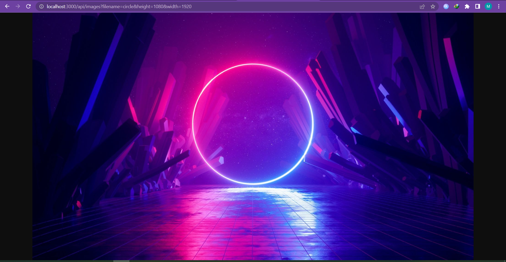
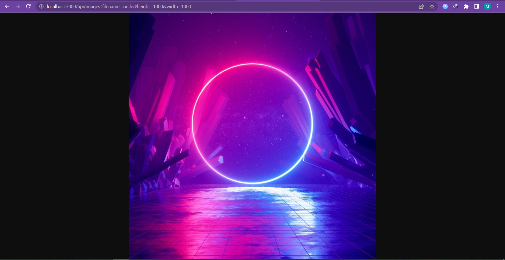
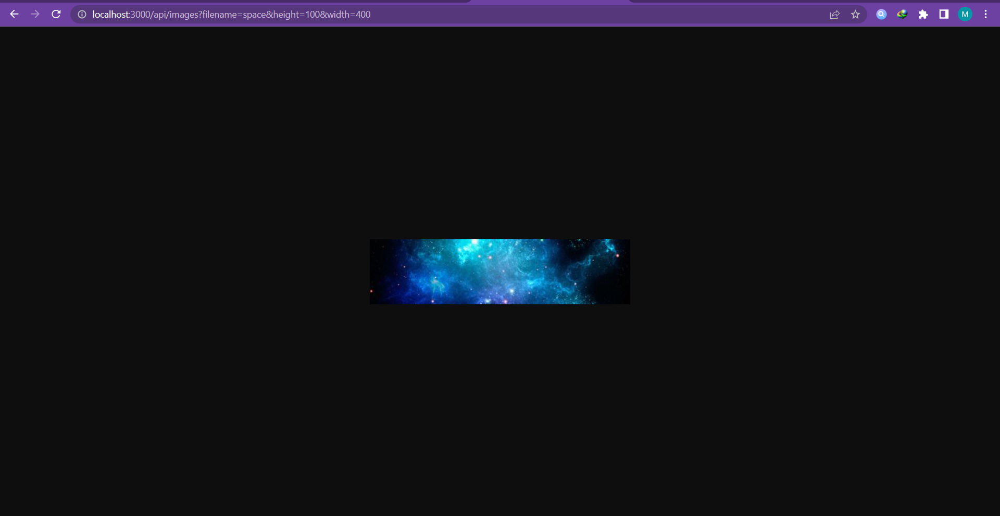
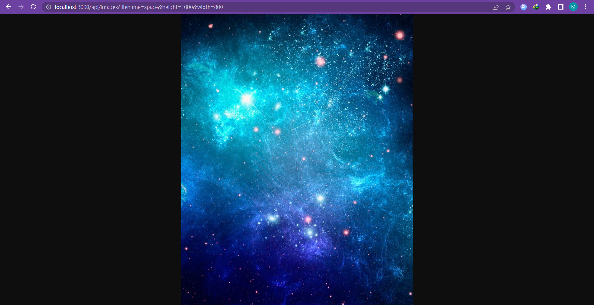

# Image-processing-API

An Image processing API for resizing images using typescript

## Installation
Clone the repo and run 
```
  npm install
```
to install all the dependencies. 

## How to use
- add your desired images in *assets/full* folder
- create a .env folder similar to .env_default
- run ``` npm run build ``` to build the project
- run ``` npm run start ``` to start the server
- go to localhost:<portNumber>/api/images?filename=<filename>&width=<width>&height=<height>
replace items in the <> by your port number and desired dimensions


## To run tests
run ``` npm run test ```

## linting and formatting

- run ``` npm run eslint ``` to lint the code
- run ``` npm run prettier ``` to format the code

## Note
- Images are resized once for each size then saved for subsequent requests
- You can resize images to multiple sizes as the thumb name contains the dimensions

## screenshots





